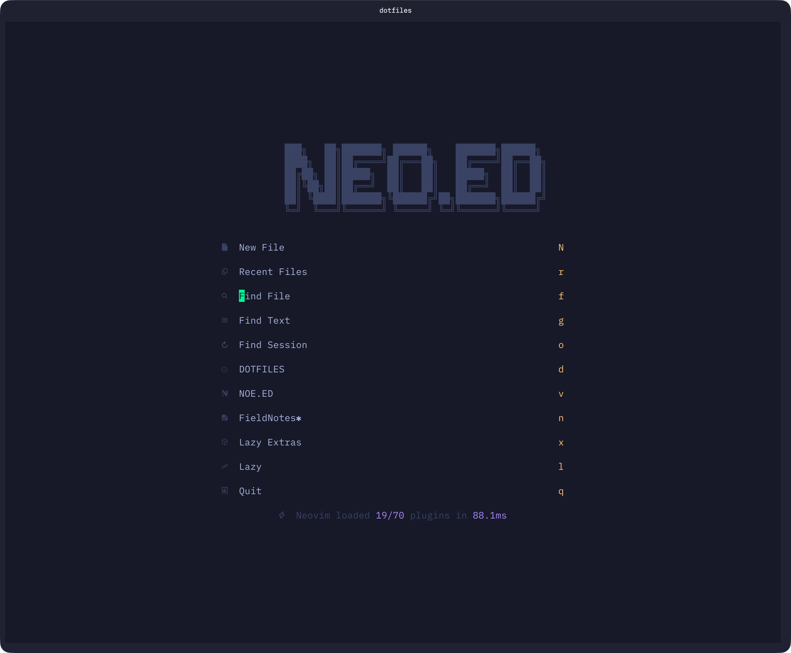
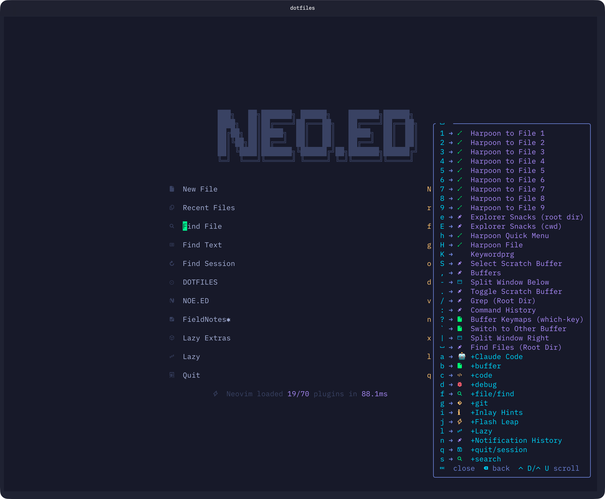
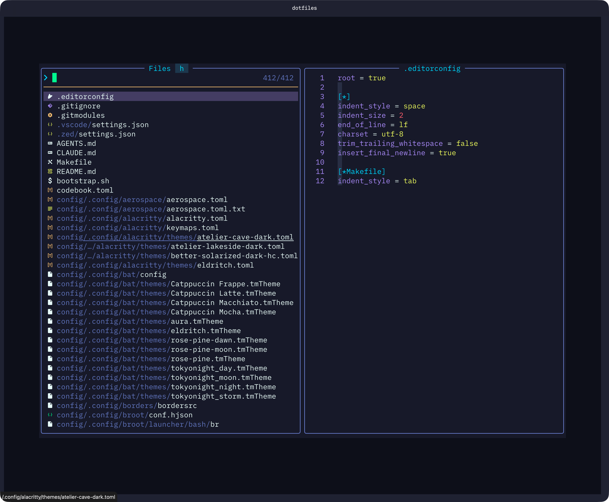
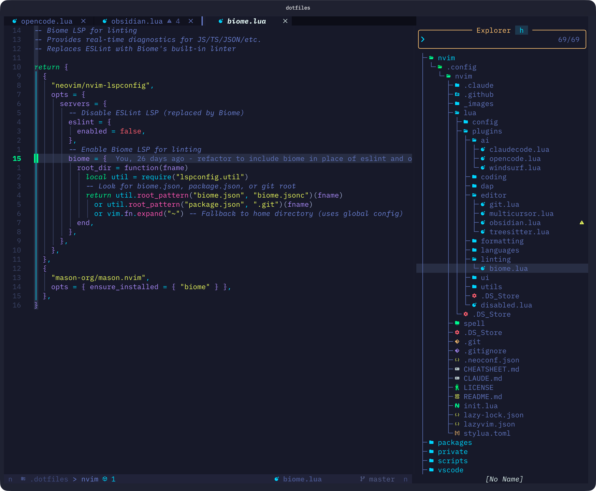
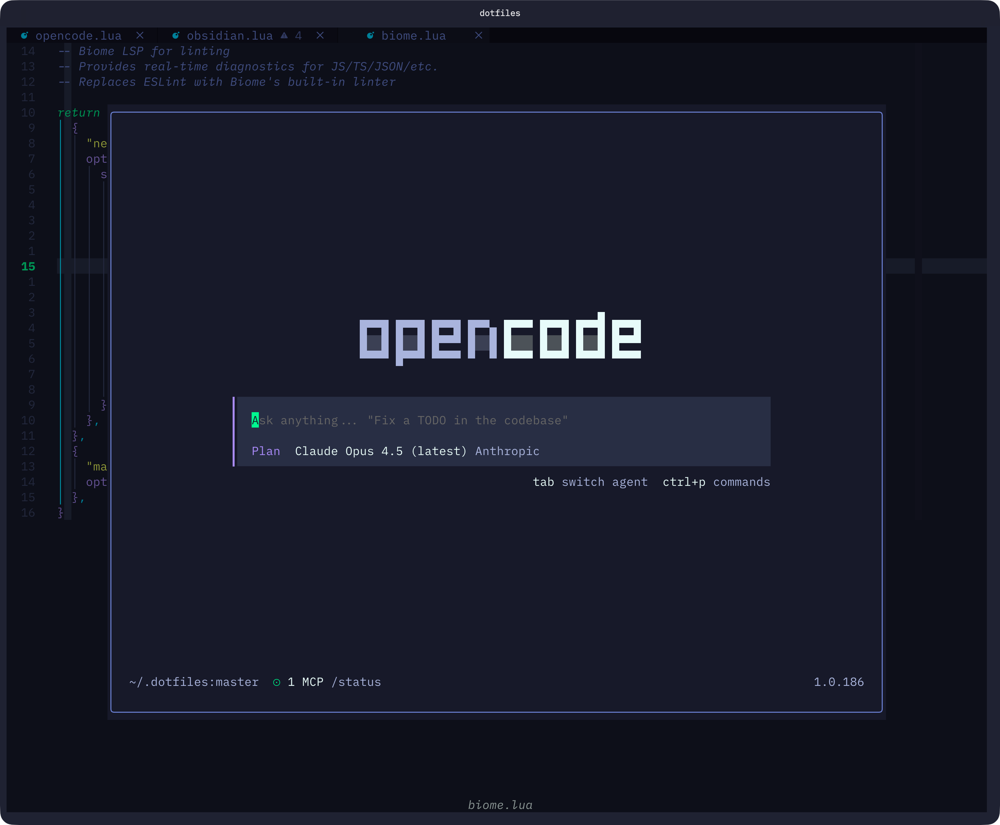
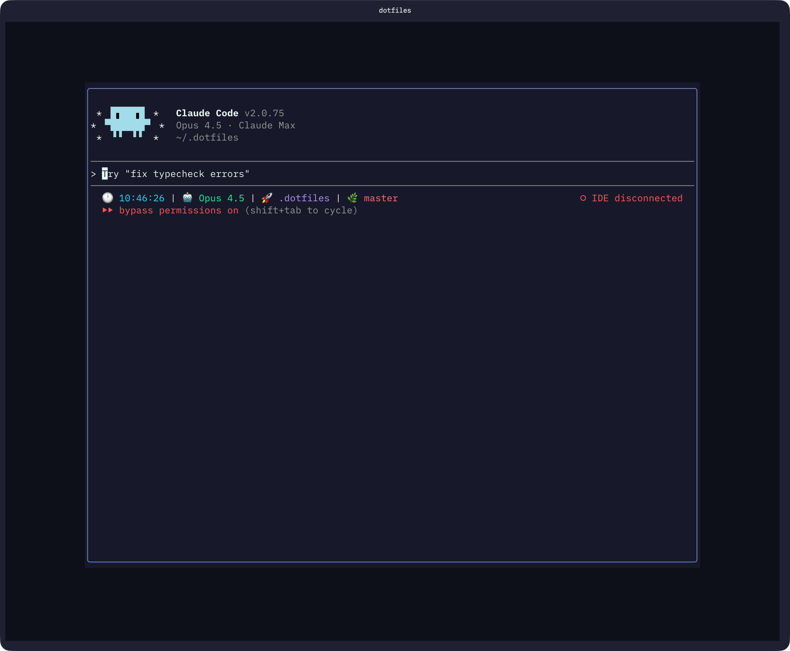

```
███╗   ██╗███████╗ ██████╗    ███████╗██████╗
████╗  ██║██╔════╝██╔═══██╗   ██╔════╝██╔══██╗
██╔██╗ ██║█████╗  ██║   ██║   █████╗  ██║  ██║
██║╚██╗██║██╔══╝  ██║   ██║   ██╔══╝  ██║  ██║
██║ ╚████║███████╗╚██████╔╝██╗███████╗██████╔╝
╚═╝  ╚═══╝╚══════╝ ╚═════╝ ╚═╝╚══════╝╚═════╝
```

# NEO.ED

> [!NOTE]
> EdHeltzel's Neovim Configuration

My personal Neovim configuration, based on LazyVim - optimized for web development and used as my ADE (AI/Agent Development
Environment) of choice.

- [E.DOTS - Dotfiles](https://github.com/edheltzel/dotfiles)
- [E.Defy - Dygma Defy keyboard](https://github.com/edheltzel/DygmaDefy)

## Features

- **LazyVim Foundation**: Built on LazyVim for a solid, well-maintained base
- **AI Integration**: opencode and Claude Code with Codeium and Supermaven for text completion
- **Multi-Language**: JavaScript/TypeScript, Go, Python, PHP/WordPress, Rust, and more
- **Hybrid Formatting**: Biome-first with Prettier fallback
- **Custom Theme**: [Eldritch](https://github.com/eldritch-theme) colorscheme with custom lualine statusline

## Screenshots

|                                                              |                                                                                           |
| :----------------------------------------------------------: | :---------------------------------------------------------------------------------------: |
|               |                                    |
|  |  |
|       |                              |

---

## Table of Contents

1. [Quick Start](#quick-start)
2. [Architecture](#architecture)
3. [Plugin Categories](#plugin-categories)
4. [Keybindings Reference](#keybindings-reference)
5. [Language Support](#language-support)
6. [Configuration Guide](#configuration-guide)
7. [Workflows](#workflows)

---

## Quick Start

### Prerequisites

- Neovim >= 0.10.0
- Git
- A Nerd Font (for icons)
- Node.js (for LSP servers)
- Ripgrep (for search)

### Installation

This configuration is part of my [Dotfiles](https://github.com/edheltzel/dotfiles) repo managed with GNU Stow:

```bash
# Clone the dotfiles repository
git clone https://github.com/edheltzel/dotfiles ~/.dotfiles

# Stow the nvim package
cd ~/.dotfiles
just stow nvim

# Or manually
stow -v nvim
```

### First Launch

1. Open Neovim: `nvim`
2. Lazy.nvim will automatically install all plugins
3. Run `:Mason` to install LSP servers and formatters
4. Run `:LazyExtras` to enable additional language packs

---

## Architecture

### Directory Structure

```
lua/
├── config/              # Core configuration
│   ├── lazy.lua        # Plugin manager bootstrap
│   ├── options.lua     # Vim options
│   ├── keymaps.lua     # Custom keybindings
│   ├── autocmds.lua    # Autocommands
│   └── filetypes.lua   # Custom filetype associations
│
└── plugins/             # Plugin configurations
    ├── disabled.lua    # Disabled plugins (neo-tree)
    │
    ├── ai/             # AI assistants
    │   ├── claudecode.lua
    │   ├── opencode.lua
    │   └── windsurf.lua
    │
    ├── coding/         # Code editing
    │   ├── emmet.lua
    │   └── surround.lua
    │
    ├── editor/         # Editor enhancements
    │   ├── flash.lua
    │   ├── git.lua
    │   ├── multicursor.lua
    │   ├── obsidian.lua
    │   └── treesitter.lua
    │
    ├── formatting/     # Code formatters
    │   └── prettier.lua
    │
    ├── linting/        # Linters
    │   └── biome.lua
    │
    ├── languages/      # Language-specific configs
    │   ├── astro.lua
    │   ├── docker.lua
    │   ├── ghostty.lua
    │   ├── go.lua
    │   ├── jinja.lua
    │   ├── markdown.lua
    │   ├── php.lua           # PHP/WordPress (phpactor)
    │   ├── python.lua
    │   ├── tailwind.lua
    │   └── typescript.lua
    │
    ├── ui/             # UI customization
    │   ├── colorscheme.lua
    │   ├── lualine.lua
    │   ├── noice.lua
    │   ├── treesitter-context.lua
    │   └── lualine/          # Statusline themes
    │       ├── neoed.lua         # Theme adapter
    │       ├── aura.lua
    │       ├── eldritch.lua
    │       ├── rose-pine.lua
    │       └── tokyonight.lua
    │
    └── utils/          # Snacks.nvim utilities
        ├── snacks-dashboard.lua
        ├── snacks-image.lua
        ├── snacks-notifier.lua
        ├── snacks-persistence.lua
        ├── snacks-picker.lua
        └── snacks-projects.lua   # Project manager (like VSCode)
```

### Plugin Load Order

1. `init.lua` - Entry point, loads `config.lazy`
2. `config/lazy.lua` - Bootstraps lazy.nvim, loads filetypes
3. LazyVim base plugins load
4. Custom plugin specs load (in directory import order)
5. `config/options.lua` - Vim options
6. `config/keymaps.lua` - Keybindings (VeryLazy)
7. `config/autocmds.lua` - Autocommands (VeryLazy)

---

## Plugin Categories

### AI Assistants

| Plugin          | Description             | Key Binding      |
| --------------- | ----------------------- | ---------------- |
| opencode.nvim   | opencode integration    | `<C-A-S-o>`      |
| claudecode.nvim | Claude Code integration | `<C-A-S-c>`      |
| codeium         | AI code completion      | (via LazyExtras) |
| supermaven      | AI code completion      | (via LazyExtras) |

**opencode Configuration** (`lua/plugins/ai/opencode.lua`):

- Floating window (80% width/height)
- Rounded border
- `YOLO` or `dangerously-skip-permissions` is enabled by default with opencod

**Claude Code Configuration** (`lua/plugins/ai/claudecode.lua`):

- Floating window (80% width/height)
- Rounded border
- `--dangerously-skip-permissions` mode enabled

### Editor Enhancements

| Plugin           | Description      | Key Bindings               |
| ---------------- | ---------------- | -------------------------- |
| multicursor.nvim | Multiple cursors | `<C-S-l>`, `<C-A-down/up>` |
| gitsigns.nvim    | Git integration  | Current line blame enabled |
| flash.nvim       | Motion plugin    | `<leader>jj`               |

### Formatting Stack

**Formatter Priority** (from `lua/plugins/formatting/prettier.lua`):

1. Biome (primary for JS/TS/JSON/CSS)
2. Prettier (fallback for Biome-supported, primary for HTML/MD)
3. yamlfmt (YAML files)

### UI Components

| Component     | Plugin           | Configuration                |
| ------------- | ---------------- | ---------------------------- |
| Colorscheme   | eldritch.nvim    | Dark theme with dim inactive |
| Statusline    | lualine.nvim     | Custom NEO.ED theme          |
| File Explorer | snacks.explorer  | Right sidebar, hidden files  |
| Picker        | snacks.picker    | Default layout               |
| Dashboard     | snacks.dashboard | Custom NEO.ED header         |
| Terminal      | snacks.terminal  | Borderless float             |
| Projects      | snacks.projects  | Project manager (like VSCode)|

---

## Keybindings Reference

See [CHEATSHEET.md](./CHEATSHEET.md) for the complete keybindings reference.

---

## Language Support

### Enabled LazyVim Extras

From `lazyvim.json`:

**AI**:

- `ai.claudecode` - Claude Code integration
- `ai.codeium` - AI completion

**Coding**:

- `coding.mini-surround` - Surround text objects
- `dap.core` - Debug adapter protocol

**Editor**:

- `editor.harpoon2` - Quick file navigation
- `editor.mini-files` - File browser
- `editor.snacks_explorer` - Snacks file explorer
- `editor.snacks_picker` - Snacks picker

**Formatting**:

- `formatting.biome` - Biome formatter/linter

**Languages**:

- `lang.angular` - Angular
- `lang.astro` - Astro
- `lang.docker` - Docker/Compose
- `lang.elixir` - Elixir
- `lang.go` - Go
- `lang.helm` - Helm charts
- `lang.json` - JSON
- `lang.markdown` - Markdown
- `lang.php` - PHP
- `lang.python` - Python
- `lang.rust` - Rust
- `lang.svelte` - Svelte
- `lang.tailwind` - Tailwind CSS
- `lang.terraform` - Terraform
- `lang.toml` - TOML
- `lang.typescript` - TypeScript
- `lang.vue` - Vue
- `lang.yaml` - YAML

**Utilities**:

- `util.dot` - Dotfile support
- `util.mini-hipatterns` - Pattern highlighting

### Language-Specific Features

#### Go (`lua/plugins/languages/go.lua`)

**LSP**: gopls with enhanced settings

- gofumpt formatting
- Inlay hints (parameters, types, values)
- Static analysis (nilness, unused params/writes)
- Semantic tokens

**Testing**: neotest-golang

#### Python (`lua/plugins/languages/python.lua`)

**LSP**: Pyright + Ruff

- Pyright for type checking
- Ruff for linting (replaces ESLint behavior)

**DAP**: debugpy integration

**Virtual Environments**: venv-selector.nvim

#### TypeScript (`lua/plugins/languages/typescript.lua`)

**LSP**: vtsls (not tsserver)

- Complete function calls
- Auto-update imports on file move
- Inlay hints
- Move to file refactoring

**DAP**: js-debug-adapter

**Custom Icons**: eslintrc, package.json, tsconfig, etc.

#### PHP/WordPress (`lua/plugins/languages/php.lua`)

**LSP**: phpactor

- Blade template support
- WordPress development optimized
- Diagnostics disabled (no "function not found" errors)

**Formatter**: phpcbf with WordPress coding standards

**DAP**: php-debug-adapter

**WordPress Setup**:
For WordPress projects, add `php-stubs/wordpress-stubs` via Composer and create a `.phpactor.json`:
```json
{
  "php_code_sniffer.enabled": false,
  "language_server_worse_reflection.diagnostics.enable": false,
  "indexer.stub_paths": ["%project_root%/vendor/php-stubs/wordpress-stubs"]
}
```

---

## Configuration Guide

### Vim Options (`lua/config/options.lua`)

```lua
-- Terminal Background Sync (OSC 11/111)
-- Eliminates padding gap by syncing terminal bg with colorscheme
-- Works with: WezTerm, Kitty, Ghostty, Alacritty

-- UI
opt.cursorline = true       -- Highlight current line
opt.cursorcolumn = true     -- Highlight current column
opt.scrolloff = 999         -- Keep cursor centered
opt.wrap = true             -- Wrap long lines

-- Files
opt.swapfile = false        -- No swap files
opt.backup = false          -- No backup files
opt.undofile = true         -- Persistent undo

-- Timing
o.timeoutlen = 250          -- Key sequence timeout

-- Platform
g.codeium_arch = "arm64"
g.codeium_os = "Darwin"
```

### Custom Filetypes (`lua/config/filetypes.lua`)

| Extension/Pattern | Filetype   |
| ----------------- | ---------- |
| `.njk`            | htmldjango |
| `.webc`           | htmldjango |
| `.conf`           | sh         |
| `*.blade.php`     | blade      |
| `*.svg`           | html       |

### Autocommands (`lua/config/autocmds.lua`)

1. **YAML Frontmatter**: Enables YAML syntax in template files
2. **Help Windows**: Opens help in vertical split
3. **Auto Resize**: Equalizes splits on window resize
4. **No Auto Comment**: Disables automatic comment continuation
5. **Dotenv Syntax**: Highlights `.env` files as `dosini`

### Theme Configuration

**Colorscheme**: Eldritch (`lua/plugins/ui/eldritch.lua`)

- Transparent: false
- Dim inactive: true
- Dark sidebars and floats
- Custom background: `#171928`

**Statusline**: Custom lualine theme (`lua/plugins/ui/lualine/neoed.lua`)

- Centered filename
- Mode indicator (left and right)
- Project directory
- Git branch and diff
- Diagnostics
- Macro recording indicator

---

## Workflows

### Daily Development

1. **Start Neovim** - Dashboard shows recent files, dotfiles shortcuts
2. **Open Project** - Use `<leader>fp` to browse projects (scans ~/Developer and ~/Sites)
3. **Find Files** - Use `<leader>ff` for file picker
4. **Navigate Files** - Use Snacks explorer (right sidebar)
5. **Edit with Multi-Cursor** - `<C-n>` for next match
6. **Format on Save** - Biome/Prettier automatically formats

### Project Management

The `snacks-projects` module works similarly to **VSCode's Project Manager extension**:

- Press `<leader>fp` to open the project picker
- Scans `~/Developer` and `~/Sites` for git repositories (up to 4 levels deep)
- Selecting a project loads its session automatically
- Configure additional directories in `lua/plugins/utils/snacks-projects.lua`

### Git Workflow

1. Open Lazygit: `<leader>gg`
2. View inline blame (automatic via gitsigns)
3. Stage changes in Lazygit
4. Commit with conventional messages

### Debugging (DAP)

1. Set breakpoints
2. Start debug session with language-specific commands
3. Use DAP UI for inspection

### AI-Assisted Coding

1. Toggle Claude Code: `<C-A-S-c>`
2. Floating window appears (80% size)
3. Ask questions or request code changes
4. Claude Code can read/modify files directly

---

## Troubleshooting

### Plugin Issues

```vim
:Lazy          " Open plugin manager
:Lazy sync     " Sync plugins
:Lazy health   " Check plugin health
```

### LSP Issues

```vim
:LspInfo       " Check LSP status
:LspLog        " View LSP logs
:Mason         " Manage LSP servers
```

### Performance

```vim
:LazyProfile   " Profile startup time
```

### Reload Configuration

```vim
:source %      " Reload current file
" Or restart Neovim
```

---

## Changelog

### v1.0.0 (2026-02-03)

**First stable release**

- **Terminal Background Sync**: OSC 11/111 integration eliminates padding gaps in WezTerm, Kitty, Ghostty, Alacritty
- **Theme Support**: Eldritch (default), Aura, Rose Pine (including Dawn for light mode), Tokyo Night
- **AI Integration**: Claude Code and opencode with floating windows
- **Project Management**: VSCode-style project picker scanning ~/Developer and ~/Sites
- **Modular Snacks**: Dashboard, explorer, picker, notifier, persistence split into individual configs
- **Custom Lualine**: Colorscheme-adaptive statusline with mode indicators

---

## License

Part of the dotfiles repository. See main repository for license information.
